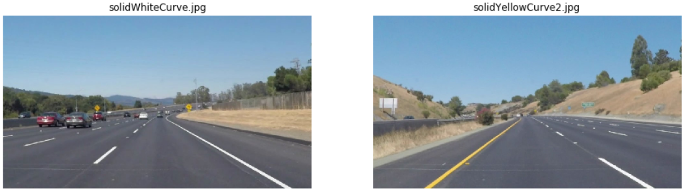
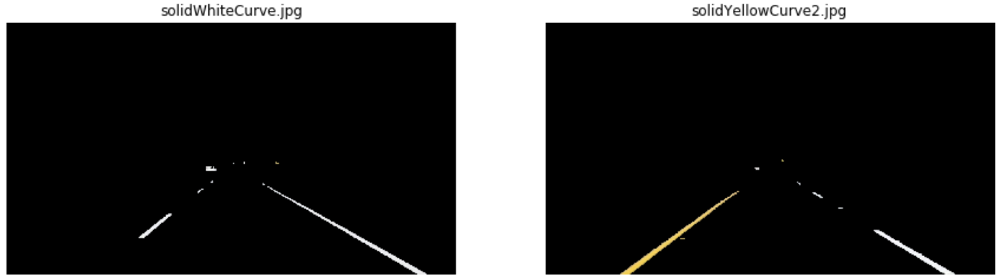
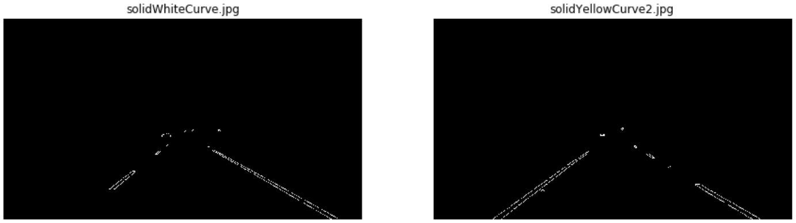
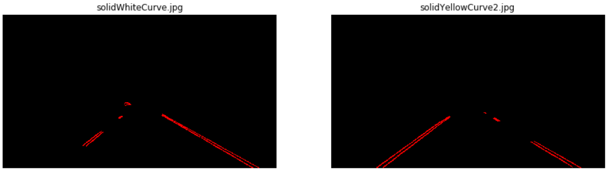
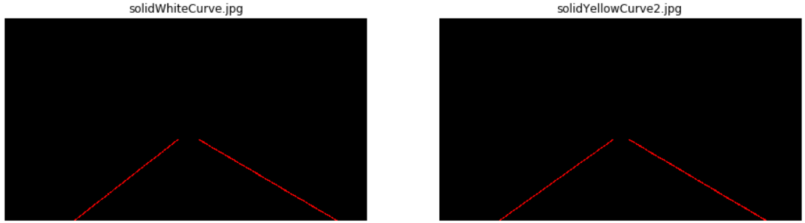
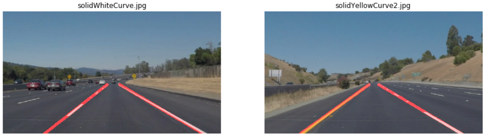

# **Finding Lane Lines on the Road** 

---

The goal of this project are making a Computer Vision algorithm able to find the lane lines in a video recorded by a camera mounted on the front of a car. This work will be followed by a brief documentation/overview contained in this file. This project is a completed version of the sample project template provided by the Self-Driving Car Engineer Udemy's nanodegree. The un-completed original version is [this repository](https://github.com/udacity/CarND-LaneLines-P1).

A demo video of the performance of this approach is available in YouTube:

---

## Reflection

### 1. Pipeline description.

My pipeline is composed 4 steps that are explained in the following paragraphs:
First, I did a **double color filter**, generating two masks, one with the pixels considered yellow and anotherone with the white ones. After it, I **combined both masks and dilated them** to get a bit more of color for Canny to consider during the gradient computation. It is worth to mention the usage of the HSV color space for the color filtering.

After removing the pixels outside the combined color mask, I built another mask with the **region of interest** (RoI) and applied it to remove some noise which color was similar to the lane lines ones (such as signals, other lane limits, etc.).

Next, once having a decently cleaned image, I search for pixels belonging to edges using the **Canny algorithm** to detect high and sharp gradients.

Finally, using the sparse Canny-provided points, I compute lines that connect them making use of the **Hough Transform**. Since the test videos were not containing curves, I tried to promote the selection of lines whose points are close to each other and, specially, with a high amount of detected points. This way, the majority of the small ammout of non-lane lines pixels that remain actived will not be considered lines. The obtained lines are drawn in the original image.

Apart of adding a few try-except orders to the **draw_lines() function** to make it more stable robuts, in order to draw a single line on the left and right lanes, I modified it by computing the slope of every detected line and classifying them as a right or left limits of the lane based on if their **slopes are positive or negatives**. If they are in **between -0.3 and 0.3, they are discarded**, given that they are usually between 0.5 and 0.7. After this, I make an **average** of all the lines and I build a new line that will be the only one I draw in the final result. It is essential to highlight that, in order to be able to apply the line equation (*y=mx+b*), I had to modify the way I interpreted the axis, **operating as if the image was rotated 90º counter-clockwise**, so that the origin will be on the bottom left corner and the Y axis will be the horizontal one and the X, the vertical one. This is why the line equation that is used is *x=my+b*.

---

### 2. Potential shortcomings

One potential shortcoming would be what would happen when the car is going trough a road with **non yellow or white lane lines** or even if there is **another illumination**, such as at night.

Another shortcoming could be the **camera being mounted in another place** (e.g. on one side of the car), because the RoI will no longer make sense.

Other possible shortcoming are more **curved roads**. One of the biggest restrictions of my algorithm is requiring the lane lines to be long, which will not happen in the middle of a pronounced curve.

---

### 3. Possible improvements 

A possible improvement would be to try to adapt **more complex shapes to the points obtained with Canny**. **RANSAC** could be a powerful tool to do so, but it would be difficult to avoid false positives.

Another option could be to consider the **temporal dimension** in the lane detection. Sometimes my algorithm does not detect any valid line given the constraints I stablish. Some kind of **moving average** could help to predict a result when no one is found and even to correct the wrong ones.

Finally, regarding the modifications I did to the ***draw_lines()*** function*, I could make a **weighted average** of the lines instead of a standard one, giving more importance to the bigger ones.
