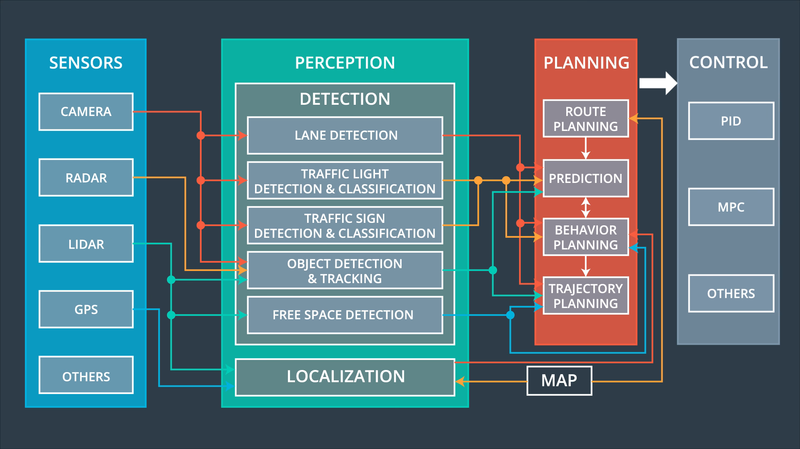

# System Integration Module

The target of this module is to integrate the previously studied modules of a self-driving car. An autonomous vehicle can be divided in the following sub-systems:

- **Sensors** sub-system, formed by the sensors in the car, such as RADARs, LIDARs, cameras, GPS, etc.
- **Perception** sub-system, in charge of process the data aquired from the sensors.
- **Planning** sub-system, which uses the output of the perception module for behavior planning and short and long term path planning. 
- **Control** sub-system, whose task is to send the appropiate control commands to the car to make sure it follows the orders coming from the planning module.

They interact between each other as shown in the next picture (from the Udacity's Self-Driving Car Engineer ND): 

## Sensor Sub-System
The sensors that are typically included in self-driving cars are cameras, LIDARs, RADARs, GPS, [IMUs](https://en.wikipedia.org/wiki/Inertial_measurement_unit), [ultrasonics](https://en.wikipedia.org/wiki/Parking_sensor).

## Perception Sub-System
It turns the data from the sensor into structured information usable by the planning and control modules. This sub-system is what determines how the car understands its environment. It can be sub-divided into two other sub-systems:

- **Detection**: It detects, classifies and/or tracks key objects from the environment, such as lanes, traffic signs and lights, cars, humans, free space, etc. It usually uses sensors such as LIDARs, RADARs and cameras.
- **Localization**: Uses data from sensors and the map to determine the vehicle's location. Even most sensors can be used for this purpose, the most popular approach is to use a LIDAR as the main source of data to solve this problem. Some related reading about this are:
  - [An Accurate GPS-IMU/DR Data Fusion Method for Driverless Car Based on a Set of Predictive Models and Grid Constraints](https://www.mdpi.com/1424-8220/16/3/280/htm)
  - [Localizing Ground Penetrating RADAR: A Step Toward Robust Autonomous Ground Vehicle Localization](https://onlinelibrary.wiley.com/doi/full/10.1002/rob.21605)

## Planning Sub-System
Some components of this sub-system are:

- **Route Planning**: Determine the high level path the vehicle will follow between two points in the map. For example, which highways or road should the car drive through to arrive to the destination.
- **Prediction**: Predict what are going to do the moving objects around the ego car in the near future. Its main input are the detected vehicles, but it can take advantage of additional knowledge such as the location, traffic signs, free space detection, etc.
- **Behavior Planning**: Plan at high level what maneuver the system will perform, such as slowing down, accelerating, changin lane, turning to the left, etc. It will use the predictions of the prediction module alongside other information such as vehicle, lanes and free space detection, traffic sign classification or localization.
- **Trajectory Generation**: Create a precise path that the vehicle should follow.

## Control Sub-System
It ensures that the vehicle follows the path specified by the planning sub-system. It includes PID controllers or Model Predictive Controllers (MPC), between others. It sends acceleration, breaking and steering commands to the vehicle to complete the chain of processes that connects sensor data to self-driving.

